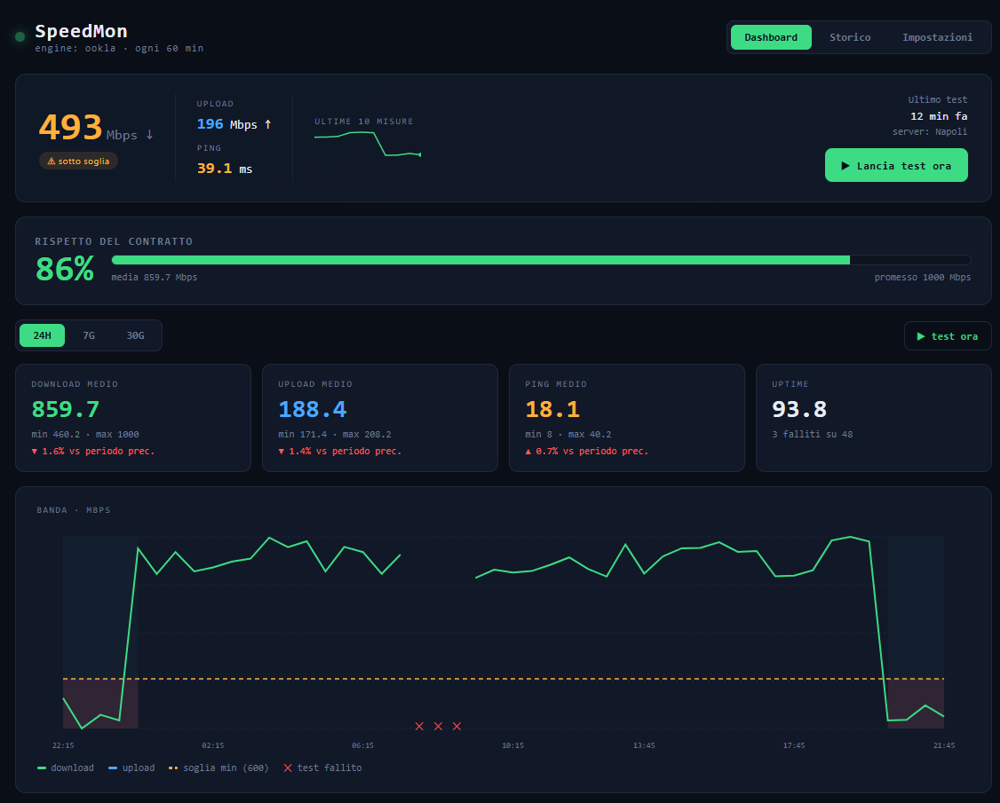
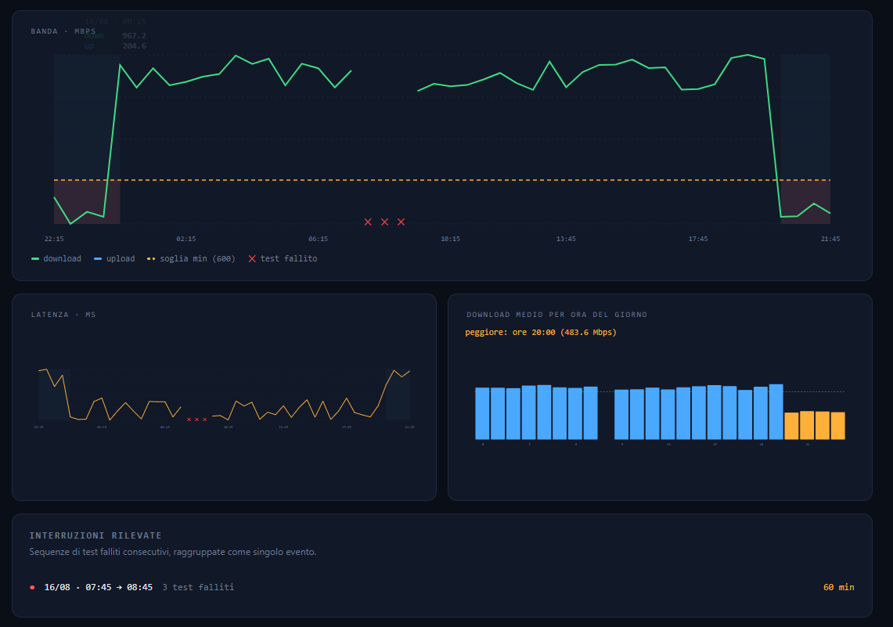
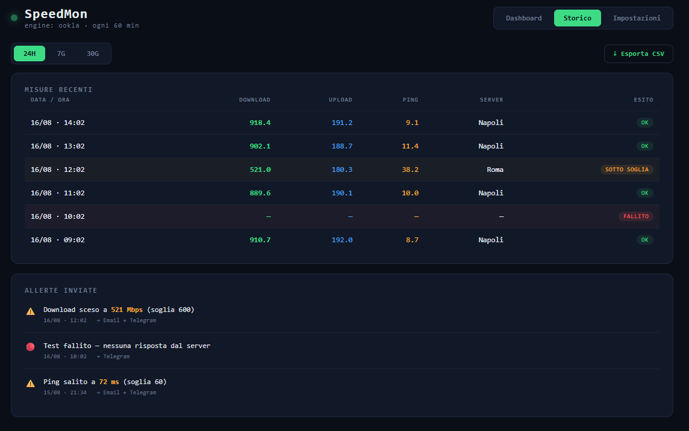
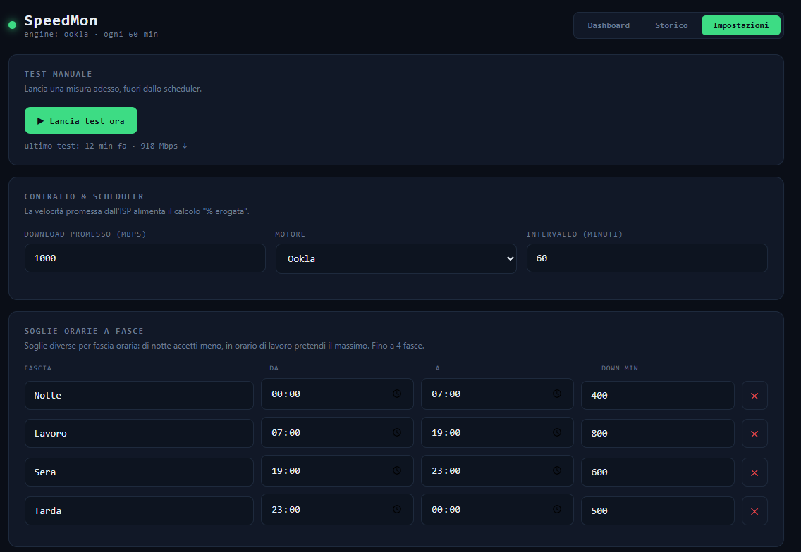
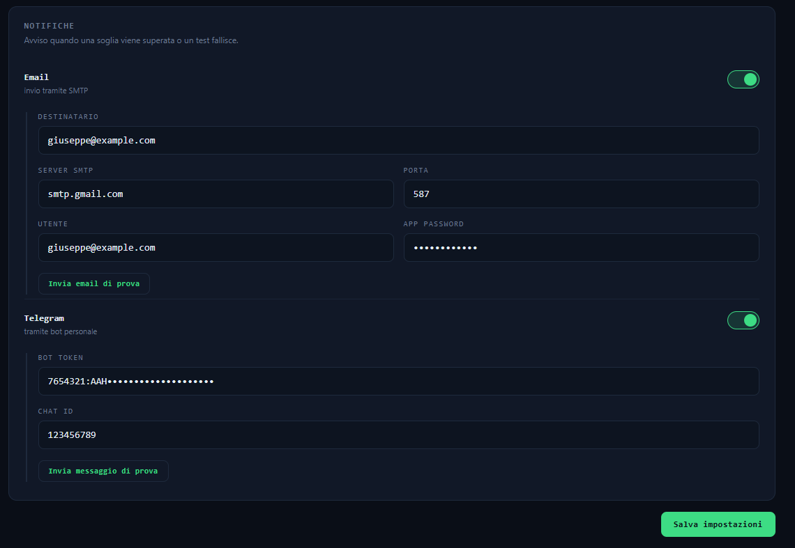

<div align="center">
  
  <h1>SpeedMon</h1>
  <p>Monitor self-hosted della connessione: speed test automatici, storico, soglie, notifiche e report.</p>
</div>



## Cosa fa

SpeedMon esegue speed test a intervalli regolari, salva lo storico e ti mostra una dashboard con grafici e analisi. Ti avvisa via email o Telegram quando la connessione scende sotto le soglie che imposti, e ti dice quanto della velocità promessa dal tuo provider stai realmente ricevendo.

- Test schedulato con motore selezionabile: **Ookla** o **LibreSpeed**
- Server bloccabile per misure confrontabili nel tempo (o automatico)
- Storico su **SQLite** — un solo file, backup banale
- Dashboard: download / upload / ping nel tempo, medie, min/max, uptime
- **Rispetto del contratto**: % della velocità promessa effettivamente erogata
- **Soglie orarie a fasce** (fino a 4): pretendi di più negli orari che contano
- **Notifiche** email (SMTP) e Telegram su soglia superata o test fallito
- **Rilevamento interruzioni**: test falliti consecutivi raggruppati con durata
- **Report periodici** via email (settimanali o mensili)
- Confronto periodo su periodo, test manuale on-demand, export dei dati
- API REST per interrogare tutto da fuori

## Screenshot

### Dashboard
Ultimo test in evidenza con pulsante di lancio manuale, rispetto del contratto, KPI con confronto sul periodo precedente.


### Grafici e interruzioni
Banda con soglia e aree sotto-soglia evidenziate, latenza, download medio per ora del giorno e interruzioni rilevate.



### Storico
Tabella delle misure con esito colorato e log delle allerte inviate sui vari canali.



### Impostazioni
Contratto, motore, server, soglie orarie a fasce, notifiche e report — tutto configurabile dall'interfaccia.





## Avvio rapido (Docker)

```bash
git clone https://github.com/<tuo-utente>/speedmon.git
cd speedmon
docker compose up -d --build
```

Apri **http://<indirizzo-del-server>:8765**.

I dati (database e impostazioni) restano nella cartella `./data`, montata come volume. Per un backup basta copiare quella cartella.

## Configurazione

Tutto si configura dalla scheda **Impostazioni** nell'interfaccia: motore, intervallo, server, contratto, soglie, fasce orarie, notifiche e report. Non serve toccare file.

La porta di default è **8765**; per cambiarla modifica la mappatura in `docker-compose.yml` (`"NUOVA:8765"`).

### Notifiche email (Gmail)

Serve una **password per le app** (non la password normale): attiva la verifica in due passaggi su Google, genera la password app e usala nel campo App password. Server `smtp.gmail.com`, porta `587`.

### Notifiche Telegram

Crea un bot con **@BotFather** (`/newbot`) per ottenere il **token**, avvia una chat col tuo bot, poi recupera il tuo **chat ID** con **@userinfobot**. Inserisci token e chat ID nelle impostazioni.

## API

| Endpoint | Descrizione |
|---|---|
| `GET /api/results?hours=24` | misure grezze |
| `GET /api/stats?hours=24` | aggregati (medie, min/max, uptime, delta) |
| `GET /api/hourly?hours=168` | media download per ora del giorno |
| `GET /api/outages?hours=720` | interruzioni rilevate |
| `GET /api/settings` · `PUT /api/settings` | leggi/salva configurazione |
| `GET /api/servers` | server disponibili per il motore attivo |
| `POST /api/run` | lancia un test on-demand |
| `POST /api/test-notify?channel=email\|telegram` | invia una notifica di prova |
| `GET /api/export?hours=720` | export JSON scaricabile |

## Dove sono i dati

Tutto in un unico file SQLite: `data/speedmon.db`. Per consultarli: la scheda **Storico** con export, l'endpoint `/api/results`, o un programma come **DB Browser for SQLite**. Quel file è anche il backup completo.

## Note sulla sicurezza

SpeedMon non ha login: è pensato per girare **nella tua rete** o dietro un reverse proxy con autenticazione. Le impostazioni contengono credenziali SMTP e token Telegram, quindi **non esporre la porta 8765 direttamente su internet** senza una protezione davanti.

## Sviluppo locale

```bash
# backend
cd backend && pip install -r requirements.txt
uvicorn main:app --reload --port 8765

# frontend (altro terminale)
cd frontend && npm install && npm run dev
```

Il dev server Vite fa da proxy verso il backend sulla 8765.

## Stack

FastAPI + APScheduler + SQLite sul backend, React + Recharts sul frontend, tutto in un unico container Docker.

## Licenza

MIT — vedi [LICENSE](LICENSE).

---

<div align="center">Creato da <b>Giuseppe Allegretto</b></div>
